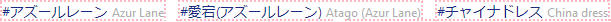
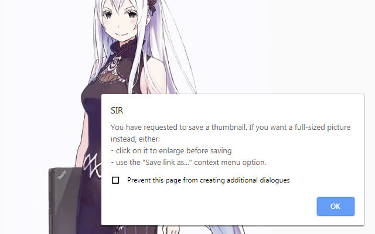

# SIR #
**SIR** is an **Image Renamer** extension for Google Chrome and Mozilla Firefox.

## Description ##
**SIR** fetches data from popular image galleries, suggesting informative file names through the usual save file dialog.

The result by default looks like:

`uniq_ID Author_handle@OR Author-Name Picture-Title tag another_tag tag_episode-2 tag&replaced_spaces.ext`,

where `OR` (origin) is based on a name of the supported site as follows: **A**rt**S**tation, **D**eviant**A**rt, **D**raw**F**riends, **H**entai-**F**oundry, **P**i**X**iv, **TU**mblr, **TW**itter, **M**edical**W**hiskey, **V**idy**A**rt, **D**an**B**ooru.

The resulting filename is compatible with https://github.com/0xb8/WiseTagger/issues/1 and can be further tweaked by specifying a *custom template* through the extension context menu.

*Please note:*
- *On some sites any or almost all of identifiers can be lacking (and thus cannot be fetched).*
- *Currently, Unique IDs are implemented for `pixiv_(album)_(page)`, `drawfriends_(ID)`, `medicalwhiskey_(ID)`, `vidyart_(ID)`.*

## Technical details ##
Every time a new page from the listed domains is loaded, **SIR** adds to it a content script, which responds for pings from the extension.
If the active tab has this script responding, context menu items would be enabled, allowing input.

By user request (`"SIR Image Renamer"` → `"Download with tags"`), content scripts parse the page and pass the info to renaming procedure. This procedure suggests the file downloader a name to save the file by. "Save As" dialogue is invoked depending on whether the `Suppress 'Save As'` option was selected. By default, the image is saved in your browser's default download directory.

*In addition, it is possible to manually get the list of tags by pressing `Ctrl+Shift+1` or selecting `"Get tags string"` in the context menu.*

One can see what info is discovered by **SIR** (`"SIR Image Renamer"` → `"Highlight fetched tags?"`):

Additionally, if you're on *Pixiv* and are trying to save a thumbnail, **SIR** will halt you (but won't restrict your ability to proceed):

## Installation ##
[Stable releases](https://github.com/Brawlence/SIR/releases) are published through the official stores:

Firefox: https://addons.mozilla.org/firefox/addon/sir_image_renamer/

Chromium: https://chrome.google.com/webstore/detail/sir-image-renamer/gmdcgijknjodfhggamchhhejamncbgmc

To install and run the latest (non stable) version of this extension, follow these steps:
- clone (or download the repository and unpack the archive) and place `Extension` folder in known location
- for Firefox, navigate to Debug Addons menu (`about:debugging#/runtime/this-firefox` or Menu→Addons→'Gear' Dropdown→Debug Addons) and click on `Load Temporary Add-on…`
- for Chrome, navigate to Extensions menu (`chrome://extensions/` or Menu→More tools→Extensions), enable the "Developer Mode" and click on `Load Unpacked`
- proceed to the `Extension` folder, select either the folder itself (for Chrome) or the `manifest.json` file (for Firefox)

## Recommendations ##
- **SIR** is a self-sufficient extension, yet it works wonders in conjunction with .
- Although a handy tool, it's **not** a batch downloader. You still have to manually save each file.
- Some authors include no tags whatsoever, others fill way too much useless general-sounding clutter, so if you're aiming for maximum resolution, please check and tweak the name before saving.
- Overabundant tags can sometimes exceed the filename length limit, thus they are currently trimmed to nearest space symbol below 230 symbols.  

## Planned features and TODO ##
- Implement an 'Options' page (page action) and store persistent user options
- Add yande.re to the list of supported sites

## Known bugs ##
- *Twitter* - in the timeline, unrelated tags are fetched from the whole page. Please save from individual post page for now.
- *Chromium 77* (probably others too?) - sometimes the extension fails to fetch tags. Page reload (`F5`) / Tab switch / `Get Tags String`/`Toggle Highlight` fixes that
 
If you happen to enconuter an unlisted bug, please submit it through https://github.com/Brawlence/SIR/issues/new